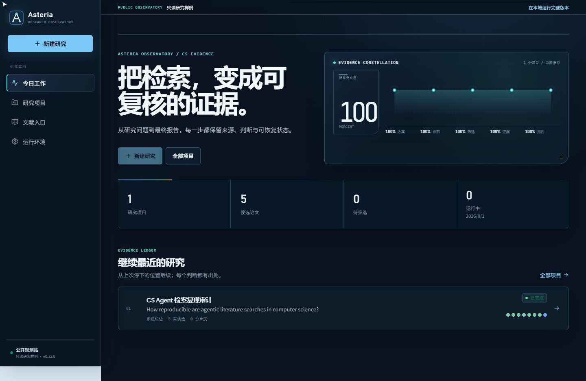
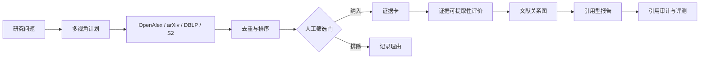

# Asteria

> 面向计算机科学的本地优先科研 Agent：把检索、人工筛选、全文、证据、复现分析与引用报告保存在同一条可审计工作流中。

[](https://github.com/Sakura1314lyc/Asteria/actions/workflows/ci.yml)
[](https://www.python.org/downloads/)
[](LICENSE)

[](CHANGELOG.md)

[在线观测站](https://asteria-observatory.vercel.app/app) · [本地安装](#五分钟本地体验) · [架构文档](docs/ARCHITECTURE.md)



Asteria 不是“输入题目后返回一篇长文”的聊天壳。它把一个研究课题保存为可恢复项目，记录研究方案、每次实际检索、论文与全文、人工纳排、证据卡、质量评价、文献图谱、报告版本和评测结果。

## 五分钟本地体验

需要 Python 3.11+，演示流程不需要密钥，也不会访问网络：

```powershell
git clone https://github.com/Sakura1314lyc/Asteria.git
cd Asteria
python -m venv .venv
.\.venv\Scripts\Activate.ps1
python -m pip install -e ".[all]"
paper-agent serve
```

打开 [http://127.0.0.1:8765/app](http://127.0.0.1:8765/app)，新建研究并选择“离线演示语料”。CLI 用户也可以直接运行：

```powershell
paper-agent run "科研智能体" --demo --fixture examples/demo_papers.json
```

也可以先打开 [Asteria Observatory](https://asteria-observatory.vercel.app/app) 浏览完整研究样例。公开站是只读评估环境：不接受 API Key、不保存修改，也不代替本地工作台。

## 它解决什么问题

| 研究环节 | Asteria 当前提供 | 留下的审计依据 |
|---|---|---|
| 方案 | 叙述性、范围、系统综述与 CS 复现审计；可修订 PICO、年份、关键词、语言与研究类型 | 研究问题、限制条件、采用的检索式，以及每次修订的原因与字段差异 |
| 检索 | OpenAlex、arXiv、DBLP、Semantic Scholar 与可插拔检索器 | 每个来源的实际查询、时间、数量、故障与去重损耗 |
| 筛选 | 标题/摘要与全文两阶段人工门；支持双人盲审和仲裁 | 追加式决定历史、理由、冲突与 PRISMA 式计数 |
| 证据 | CS 论文结构化字段、benchmark、复现性与证据缺口 | 稳定论文/证据 ID、全文页码和结构化矩阵 |
| 综合 | 证据约束对话、引用型报告与版本保存 | 段落引用、BibTeX、引用结构和词汇对齐诊断 |
| 交接 | 项目 ZIP、运行产物和 SHA-256 清单 | 可移植原始材料、配置、事件与报告 |
| 生命周期 | 编辑项目身份和研究方案；删除项目、运行、全文、对话与单篇项目文献 | 字段级修订账本、强确认、FTS/磁盘级联清理 |

默认数据保存在本机 SQLite/WAL 数据库。范围综述和系统综述会在检索后停在人工门，不会静默替研究者排除论文。

## 当前成熟度与边界

- 单机研究工作台已经贯通 Web、CLI、REST API、SQLite 状态、离线演示与可移植导出；自动化测试不调用付费模型。
- 项目资料与研究方案修改会写入 schema v6 修订账本；方案变更必须填写原因，危险删除必须输入对象名称或稳定 ID，运行中的项目/运行不能删除。
- REST API 只返回前端需要的公开视图，不暴露 SQLite、数据根目录、运行目录或后台作业内部结果。
- 当前没有账号与项目权限系统。服务默认只绑定 `127.0.0.1`，不能未经认证直接暴露到公网。
- `audit.json` 是结构与可追踪性检查，不是事实核验；摘要级质量代理也不等于正式风险偏倚工具。
- 研究者仍需阅读原文、判断方法质量、处理版权和遵守学术诚信要求。

> 适用于选题探索、开题调研、叙述性综述、范围综述、系统综述准备和论文相关工作整理。它不会替代阅读全文、正式风险偏倚评价、统计分析、领域专家判断或学术诚信责任。

## 项目来源

架构主要参考：

- [LangChain Open Deep Research](https://github.com/langchain-ai/open_deep_research)：可配置模型与检索器、阶段化研究、证据压缩和报告生成。
- [Stanford STORM](https://github.com/stanford-oval/storm)：多视角问题生成、先检索与提纲、再进行带引用写作。

本项目没有复制两者代码，而是实现了独立的 Python 分层架构，并把重点转向学术数据库、人工纳排、全文证据、长期项目状态和可审计产物。

## 计算机科学专精

工作台覆盖 AI/ML、NLP、CV、系统、网络、安全、数据库、信息检索、软件工程、PL、形式化、理论、HCI、图形学、机器人、硬件和科学计算。它依据 [arXiv 官方 CS taxonomy](https://arxiv.org/category_taxonomy) 做细粒度分类，并用 ACM CCS 思想组织上层方向。

每篇计算机论文额外抽取：

- 算法、系统、数据集、benchmark、理论、工具或用户研究等 contribution type
- 数据集、任务、基线、指标和 headline results
- 消融、算力、实现细节、代码与数据地址
- threats to validity、安全与伦理事项
- formal proof、controlled experiment、deployment、simulation、user study 等证据等级

详细说明见 [计算机科学专精](docs/COMPUTER_SCIENCE.md)。

## 系统能力

### 研究工作流



工作流具有 8 个可恢复阶段：

```text
initialized → planned → searched → screened
            → extracted → assessed → written → completed
```

范围综述和系统综述默认停在 `searched`，等待人工逐篇决定后再继续。

### 长期科研工作台

- SQLite/WAL 项目库，可管理多个课题和多次运行。
- 论文、证据卡、筛选决定、质量评价、文档和报告版本化保存。
- 支持独立双人盲审、完成后揭盲、冲突仲裁和追加式决定历史。
- 标题/摘要与全文两阶段门禁；记录全文获取、未取得原因和结构化排除理由。
- PDF、Markdown、纯文本入库；页码级抽取和 SQLite FTS5 全文检索。
- 研究方案支持 PICO 字段、年份、关键词、语言与研究类型限制。
- 透明规则只提供筛选“建议”，正式纳排必须由人确认。
- 后台作业队列、运行事件流和失败状态记录。
- 五种 CS 科研 Agent 配置，真实影响计划、证据抽取与报告提示。
- 项目级证据对话，持久保存消息并回链论文 ID 与全文页码。
- Web 内接入 Responses API 或 OpenAI 兼容 Chat Completions。
- 本地 REST API，可通过 `/docs` 使用交互式 OpenAPI 页面。

### 可审计产物

每次完整运行产生：

```text
state.json                    完整检查点
events.jsonl                  阶段事件轨迹
plan.json                     研究计划与检索式
search_log.json               来源、实际查询式、时间、数量与故障的逐次检索账本
search_results.json           去重后的论文
screening.json                纳排决定与理由
evidence.json                 逐篇证据卡
quality.json                  摘要级可提取性评价
study_matrix.csv              可在 Excel 中打开的研究矩阵
review_flow.json              PRISMA 式流程计数
literature_graph.json         文献关系图
literature_graph.graphml      Gephi/Cytoscape 图谱
cs_classification.json        arXiv/ACM 映射后的方向标签
cs_landscape.json             方向、venue、贡献和证据分布
cs_evidence_matrix.csv        CS 实验与系统证据矩阵
benchmark_catalog.json        数据集、指标和基线目录
reproducibility.json          计算机论文复现报告评分
research_agenda.json          从证据缺口推导的候选研究议程
report.md                     引用型研究报告
references.bib                BibTeX
audit.json                    结构化引用审计
citation_grounding.json       逐段引用—来源词汇对齐诊断
evaluation.json               回归评测结果
```

## 安装

Python 3.11+。

```powershell
python -m venv .venv
.\.venv\Scripts\Activate.ps1

# CLI、数据库、Web API 和学术检索
python -m pip install -e .

# 再加入 PDF 全文解析
python -m pip install -e ".[all]"

Copy-Item .env.example .env
```

## 一分钟演示

无需密钥、无需网络：

```powershell
paper-agent run "科研智能体" `
  --demo `
  --fixture examples/demo_papers.json
```

这会使用明确标注的合成论文，只用于验证软件流程。

## Web 工作台

公开只读演示：[asteria-observatory.vercel.app](https://asteria-observatory.vercel.app/app)。它在每个 Vercel Function 实例中生成相同的确定性研究样例，服务端拒绝所有写请求；Vercel 的临时文件系统不用于承诺研究数据持久化。完整研究、模型连接、全文和项目导出请运行本地版本。

安装完整依赖并启动：

```powershell
python -m pip install -e ".[all]"
paper-agent serve
```

打开 [http://127.0.0.1:8765/app](http://127.0.0.1:8765/app)。Web 前端已经包含在 Python 安装包中，提供项目概览、模型连接、Agent 选择、项目证据对话、跨项目文献入口、RIS/BibTeX/CSL JSON 导入、三栏文献库、逐篇筛选、运行事件、证据与复现矩阵、文献图谱、报告审计和全文检索。首页用真实项目阶段生成五通道证据信号谱，项目页再用“方案 → 检索 → 筛选 → 证据 → 报告”的证据脊柱显示当前人工门与下一步，而不是虚构实时活动或只给出模糊完成百分比。

前端不是单一聊天框。交互借鉴 Zotero 的文献列表/检查器、ASReview 的人工筛选流和 Open Knowledge Maps 的图谱联动，详细说明见 [Web 工作台](docs/WEB.md)。

## 长期项目工作流

### 1. 创建系统综述项目

```powershell
paper-agent project create "科研 Agent 系统综述" `
  --topic "evidence-grounded research agents" `
  --question "科研智能体的主要架构、评价方法和证据局限是什么？" `
  --type systematic
```

命令返回 `project_id`。

### 2. 启动检索

真实研究前在 `.env` 填写 `OPENAI_API_KEY`：

```powershell
paper-agent research start <project_id>
```

系统综述会在检索后暂停。离线验证可运行：

```powershell
paper-agent research start <project_id> `
  --demo `
  --fixture examples/demo_papers.json
```

### 3. 人工纳排

探索性项目可继续使用单人模式：

```powershell
paper-agent screen list <project_id> --status pending
paper-agent screen decide <project_id> <数据库论文ID> included `
  --reason "符合研究问题与年份范围"
paper-agent screen decide <project_id> <数据库论文ID> excluded `
  --reason "仅为编辑评论，无实证方法"
```

系统综述建议开启双人盲审：

```powershell
paper-agent screen configure <project_id> `
  --reviewer reviewer-a `
  --reviewer reviewer-b

paper-agent screen status <project_id> --reviewer reviewer-a
paper-agent screen decide <project_id> <数据库论文ID> included `
  --reviewer reviewer-a `
  --reason "符合预注册纳入标准"

# 双方完成全部论文后揭盲
paper-agent screen configure <project_id> --open

# 对 included / excluded 冲突进行仲裁
paper-agent screen resolve <project_id> <数据库论文ID> included `
  --reviewer adjudicator `
  --reason "讨论后确认研究包含目标系统评价"
```

盲审由服务端裁剪响应，对方决定不会提前发送到浏览器。这里的 reviewer 是本地
工作流身份与审计标签，不是登录账户；共享部署仍需额外认证与项目权限。

### 4. 全文获取与最终纳入

标题与摘要阶段全部完成后，可启用第二阶段。上传并关联全文会自动把报告标记为
`retrieved`；无法取得时必须记录原因。全文排除必须同时填写稳定原因代码和具体说明。

```powershell
paper-agent screen fulltext configure <project_id>
paper-agent document add <project_id> paper.pdf --paper-id <数据库论文ID>
paper-agent screen fulltext status <project_id>
paper-agent screen fulltext decide <project_id> <数据库论文ID> included `
  --reason "完整实验报告满足预注册标准"
paper-agent screen fulltext decide <project_id> <数据库论文ID> excluded `
  --reason-code not_primary_research `
  --reason "全文为立场文章，没有独立实验"
```

双人项目会沿用两位 reviewer，并默认继续盲审；双方完成后使用
`paper-agent screen fulltext configure <project_id> --open` 揭盲。若两人都排除但
主要排除原因不同，也必须显式仲裁。

### 5. 继续证据综合

```powershell
paper-agent research continue <run_id>
```

### 6. 导入已有文献库

可直接使用 Zotero、EndNote 或 JabRef 导出的 RIS、BibTeX/BibLaTeX 与
CSL JSON 文件：

```powershell
paper-agent bibliography import <project_id> references.ris
paper-agent bibliography import <project_id> references.bib --json
```

导入会保留已有筛选决定与更完整的元数据，重复运行同一文件不会重复入库。当前
提供本地文件互操作，不包含 Zotero 在线账户同步。

### 7. 导入全文并检索

```powershell
paper-agent document add <project_id> paper.pdf --paper-id <数据库论文ID>
paper-agent document search <project_id> "sample size evaluation"
```

### 8. 评测与导出

```powershell
paper-agent evaluate .paper-agent\<project_id>\runs\<运行目录>
paper-agent project export <project_id> exports\my-review.zip
```

导出包包含项目元数据、论文库、两阶段筛选/改判/仲裁审计、`prisma_flow.json`、
报告、运行产物、全文和 SHA-256 清单，不包含 API 密钥。

## 本地 REST API

```powershell
paper-agent serve
```

打开：

- OpenAPI UI: [http://127.0.0.1:8765/docs](http://127.0.0.1:8765/docs)
- 健康检查: [http://127.0.0.1:8765/health](http://127.0.0.1:8765/health)

API 默认没有身份认证，只应绑定 `127.0.0.1`。部署到共享网络前必须增加反向代理认证、TLS、访问控制和配额。

## 真实模型配置

模型适配 OpenAI Responses API 和 OpenAI 兼容 Chat Completions；结构化阶段使用 JSON Schema。可在 Web 的“运行环境”中创建进程级连接，也可用 `.env` 提供默认连接。Web 输入的密钥只驻留当前服务进程内，服务重启后失效。

```dotenv
OPENAI_API_KEY=
PAPER_AGENT_MODEL=gpt-5.6-terra
OPENAI_BASE_URL=https://api.openai.com/v1
PAPER_AGENT_REASONING_EFFORT=medium
```

检索配置：

```dotenv
S2_API_KEY=
OPENALEX_EMAIL=
PAPER_AGENT_DBLP_ENABLED=true
PAPER_AGENT_MAX_PAPERS=12
PAPER_AGENT_RESULTS_PER_QUERY=6
PAPER_AGENT_MAX_QUERIES=5
```

本地数据：

```dotenv
PAPER_AGENT_DATA_ROOT=.paper-agent
PAPER_AGENT_DATABASE=.paper-agent/workbench.db
PAPER_AGENT_OUTPUT_ROOT=runs
```

## 插件

列出检索器：

```powershell
paper-agent plugins
paper-agent taxonomy classify "LLM inference systems"
```

内置 OpenAlex、arXiv、DBLP 和 Semantic Scholar。外部 Python 包可通过 `paper_agent.retrievers` entry point 注册新的检索器，参见 [插件开发](docs/PLUGIN_DEVELOPMENT.md)。

## 测试

```powershell
python -m ruff check src tests
python -m pytest -q

pnpm --dir web typecheck
pnpm --dir web test
pnpm --dir web build
```

测试不访问网络，也不会调用付费模型。前端真实页面验收使用 Playwright，依次执行探索、无交互排练和录制：

```powershell
$env:QA_BASE_URL = "http://127.0.0.1:8765"
pnpm --dir web ui:explore
pnpm --dir web ui:rehearse
pnpm --dir web ui:record
```

## 文档

- [架构设计](docs/ARCHITECTURE.md)
- [Web 工作台](docs/WEB.md)
- [品牌标志规范](docs/BRAND.md)
- [计算机科学专精](docs/COMPUTER_SCIENCE.md)
- [系统综述流程](docs/SYSTEMATIC_REVIEW.md)
- [REST API](docs/API.md)
- [插件开发](docs/PLUGIN_DEVELOPMENT.md)
- [安全与隐私](docs/SECURITY.md)
- [路线图](docs/ROADMAP.md)
- [贡献指南](CONTRIBUTING.md)

## 获取帮助与参与维护

- 使用问题、缺陷和功能提议请提交到 [GitHub Issues](https://github.com/Sakura1314lyc/Asteria/issues)。报告问题时请附版本、操作系统、最小复现步骤和已脱敏日志。
- 代码贡献先阅读 [CONTRIBUTING.md](CONTRIBUTING.md)；涉及数据模型、筛选语义或安全边界的改动应同时补迁移与回归测试。
- 项目当前由仓库维护者与贡献者共同维护，发布历史见 [CHANGELOG.md](CHANGELOG.md)，短中期缺口见 [路线图](docs/ROADMAP.md)。

## 重要证据边界

- `audit.json` 检查引用结构，不证明来源语义上支持某个论断。
- `quality.json` 衡量当前材料的“可提取性”，不等价于 RoB 2、ROBINS-I、QUADAS-2、GRADE 等正式评价。
- 自动筛选只提供建议；排除论文应保存人工理由。
- 摘要可能遗漏样本、负面结果、附录与方法细节，强结论必须回到全文。
- 合成演示数据绝不能作为真实学术来源。

## License

MIT。参考项目的著作权归各自作者所有；若直接使用 STORM 的方法或代码，请按其仓库说明引用相应论文。
