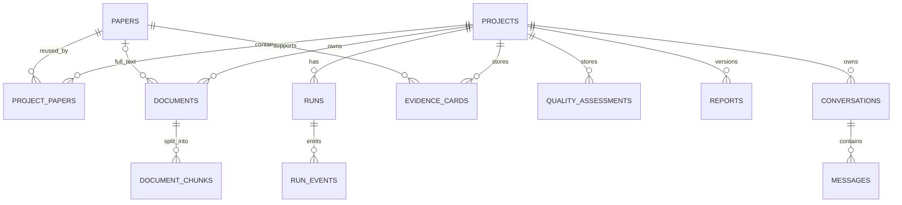

# 架构设计

## 设计目标

Paper Research Workbench 采用“分层单体”而不是一开始拆微服务。科研工作流需要强一致的状态、可恢复检查点和可复现的本地产物；SQLite、文件存储和单进程后台队列足以支持个人或小组本地使用，并保持部署简单。

## 分层

```text
React Web / CLI / REST API
      │
Application: ResearchWorkbench / JobManager
      │
Domain: Project / Protocol / Screening / Quality
      │
Workflow: ResearchAgent state machine
      │
Infrastructure: SQLite / FTS5 / file store / retrievers / LLM
```

### Domain

- `domain.py`: 项目、研究方案、运行、筛选和文档实体。
- `models.py`: 工作流内论文、证据卡和检查点状态。
- `screening.py`: 可解释规则建议，不冒充人工决定。
- `quality.py`: 当前摘要和元数据的可提取性评价。
- `profiles.py`: narrative、scoping、systematic、thesis 四种流程配置。
- `agent_profiles.py`: 可选择、可导出的 CS 科研 Agent 行为配置。

### Application

- `workbench.py`: 协调项目、运行、人工门控和数据库导入。
- `jobs.py`: 本地后台作业状态。
- `evaluation.py`: 确定性回归指标。
- `exporter.py`: 可移植 ZIP 与 SHA-256 清单。
- `research_chat.py`: 项目证据上下文、来源约束与对话回答。
- `connections.py`: 进程级模型连接和脱敏元数据。

### Web

- `web/`: React、TypeScript、Vite 源码与前端测试。
- `src/paper_agent/web_dist/`: 生产构建，由 FastAPI 以 `/app` 提供。
- Web 通过 REST API 消费项目与运行状态，不直接读取 SQLite 或运行目录。
- 前端使用轮询获取持久运行状态；事件和运行产物仍以数据库与文件为事实来源。

### Workflow

`ResearchAgent` 是显式状态机。每个阶段完成后先写专门产物，再原子替换 `state.json`。恢复时只执行未完成阶段。

系统综述路径：

1. `execute_run()` 运行到 `searched`。
2. 论文写入 `project_papers`，状态为 `pending`。
3. 人工记录 included/excluded/maybe。
4. `continue_after_screening()` 检查不存在 pending，过滤状态并把检查点推进到 `screened`。
5. Agent 继续 evidence、quality、graph、report、audit。

### Infrastructure

- SQLite 使用 WAL、外键和 busy timeout。
- 文件内容不放入数据库；数据库只保存路径、哈希和索引。
- FTS5 存储页码级文本块。
- 检索器实现统一 `Retriever` 协议。
- 模型实现统一 `LanguageModel` 协议。
- Agent 是模型之上的科研行为配置；连接是模型端点与会话凭据，两者不混同。

## 数据库主要关系



## 一致性边界

- 数据库事务保证元数据一致性。
- 运行目录是可移植事实记录；数据库可以从 `state.json` 重新导入。
- 模型输出永远不能直接决定删除或覆盖原始文献。
- 论文引用使用运行内稳定的 `P001` ID，数据库内部使用整数 ID。

## 扩展路径

单机瓶颈出现后，可替换：

- SQLite → PostgreSQL；
- `JobManager` → Celery、RQ 或云队列；
- 本地文件 → S3 兼容对象存储；
- FTS5 → OpenSearch 或向量/关键词混合检索；
- 轮询事件接口 → SSE/WebSocket。

这些替换应保留 Domain、Workflow 和产物格式。
